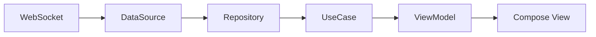

# Arquitectura de la Aplicación - StaduApp

Esta aplicación ha sido diseñada siguiendo los principios de **Clean Architecture**, **SOLID** y un patrón de diseño **MVVM** con una estructura organizada por **Features** (Funcionalidades).

## 📂 Estructura de Carpetas

La aplicación se divide principalmente en dos áreas: `core` (común) y `feature` (funcionalidades específicas).

### 1. `core/` (El núcleo)
Contiene elementos transversales que no pertenecen a una funcionalidad específica.
- **`di/`**: Localizador de servicios (`ServiceLocator`) para gestionar la inyección de dependencias.
- **`theme/`**: Definiciones globales de diseño (colores, tipografía, temas).

### 2. `feature/stadium/` (Funcionalidad de Estadio)
Aquí reside toda la lógica del control de acceso al estadio.
- **`domain/`**: El corazón de la app. Es código **Kotlin puro** (sin dependencias de Android, Compose o librerías de red).
  - **`model/`**: Entidades inmutables (`StadiumState`, `EntryEvent`).
  - **`repository/`**: Definición de la interfaz del repositorio (Regla de Inversión de Dependencia).
  - **`usecase/`**: Acciones específicas del usuario (ej: `ProcessEntryEventUseCase`).
  - **`engine/`**: Lógica de negocio pesada (`StadiumEngine` y `AssignmentStrategy`).
- **`data/`**: Implementación de la infraestructura.
  - **`datasource/`**: Conexión real con el WebSocket usando OkHttp.
  - **`repository/`**: Implementación del repositorio que gestiona la reconexión y delega en el DataSource.
- **`presentation/`**: Capa visual.
  - **`MainViewModel`**: Orquestador entre el dominio y la UI. Transforma datos del dominio a estados de UI.
  - **`StadiumScreen`**: Pantalla principal con Jetpack Compose.
  - **`components/`**: Piezas pequeñas reutilizables de la interfaz.

## 🔄 Flujo de Datos (Unidireccional)

1. Los eventos llegan por **WebSocket**.
2. El **DataSource** los convierte en objetos Kotlin.
3. El **Repository** observa estos eventos y maneja errores de conexión.
4. El **UseCase** es llamado por el ViewModel para procesar el evento.
5. El **Domain Engine** aplica las reglas y actualiza el estado.
6. El **ViewModel** expone el nuevo estado mediante un `StateFlow`.
7. La **UI** reacciona automáticamente y se repinta.

## 🛠️ Guía para Desarrolladores

### ¿Cómo agregar una regla nueva?
1. Ve a `feature/stadium/domain/engine/AssignmentStrategy.kt`.
2. Añade tu lógica en el método `determineAssignment`.
3. Al ser código puro, puedes (y debes) añadir un Test Unitario en `src/test/java/...`.

### ¿Cómo cambiar la URL del WebSocket?
Modifica la constante `WS_URL` en `core/di/ServiceLocator.kt`.

### ¿Cómo testear?
- **Tests de Dominio**: Ejecuta `./gradlew testDebugUnitTest`. La lógica de negocio está aislada de Android para ser ultra rápida.
- **Logs**: Puedes ver el flujo en la pestaña "Log" de la aplicación en tiempo real.

## 📚 Glosario
- **Inmutable**: Un objeto que no puede cambiar. Si necesitamos cambiar algo, creamos una copia nueva (`copy`). Esto evita errores de concurrencia.
- **Flow**: Un flujo de datos continuo (como una tubería de agua) que nos permite reaccionar a eventos en tiempo real.
- **UseCase**: Una clase que tiene una sola responsabilidad y representa una acción del usuario.
